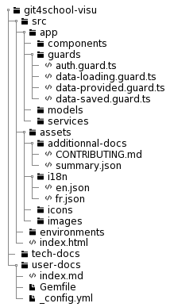

# Architecture Details

In this section we will detail the architecture of the application and the role of the main folders so that a developer can find his way around.



## app

This is here that you will spend most of your time coding. It contains most of the source code within 4 sub-folders :

- components
- guards
- models
- services

### components

This folder contains all the components of the application. If you want to add a new page or develop a new feature on an existing page, it is in this folder that you will need to place the new components.

> If you want to add or modify a graph, everything is in the folder `components/graphs`.

To create a new component, execute `ng g component components/<myComponent>`.

### guards

This folder contains the guards as used in Angular. These guards are services that can be used to authorize access to a route or the leaving of a page.
In this way, we use 3 guards :

- `auth.guard.ts`: which ensures that the user is authenticated before allowing access to a protected route
- `data-provided.guard.ts`: which ensures that valid and minimal data are loaded to ensure the proper functioning of the application. For example, if no valid configuration file is provided in the `/overview` page, it is not possible to access `/questions-completion` or `/edit-metadata`
- `data-loading.guard.ts`: which authorizes the leaving of a page if the associated component is not loading. This guard is used in the /overview page to prevent the user from leaving the page if the processing of repository data is in progress

If you want to create a new guard, do the following :

- execute `ng g guard .\guards\<myGuard>`
- select interface(s) to implement
- add the guard to route(s) in `src/app/app-routing.module.ts`
  ```typescript
  {
      path: 'myPath',
      component: MyComponent,
      canActivate: [AuthGuard, MyGuard],
      canDeactivate: [DataLoadingGuard]
  }
  ```

### models

This folder contains all the models of the application. These are classes that can be instantiated to facilitate data management in the application. We use 4 fairly explicit model classes :

- Commit
- Milestone (review, correction, other)
- Repository
- Session

To create a new model, execute `ng g class models/<myModel> --type=model`.

### services

This folder contains the application services. The services allow to perform operations that can be common to several components in the application.
Let's detail the 4 services we use:

- `auth.service.ts` : which allows to manage the user authentication to Github.
- `data.service.ts` : which allows to store the data to be shared between the components. It is thanks to it that the user can navigate in the application without having to enter the configuration file each time he changes pages.
- `json-manager.service.ts` : which allows to manage the configuration file (upload/download/verification)
- `commits.service.ts` : which allows to manage the retrieval of data from Github repositories, as well as the generation of statistical data (used for downloading and for displaying graphs `/students-commits` and `/questions-completion`)

To create a new service, execute `ng g service services/<myService>`.
Then use it in component or a service by declaring it in the constructor :

```typescript
constructor(
    private commitsService: CommitsService,
    public myService: MyService
) {}
```

> Note that if you want to use a service in a HTML file, you have to declare the service as `public` !

## assets

This folder contains useful resources for the application.

### additional docs

This folder contains useful resources for generating additional documentation such as this page.
If you want to add a page to the documentation, create a file `<myDoc>.md` and update the `summary.json` file by adding an element as following (see [this page](https://compodoc.app/guides/tips-and-tricks.html#additional-documentation)) :

```json
[
  {
    "title": "Architecture details",
    "file": "CONTRIBUTING.md"
  },
  {
    "title": "My documentation",
    "file": "myDoc.md"
  }
]
```

To build the documentation (into `docs` folder), execute `npm run doc`.

> When deploying a new version to firebase, run `npm run build:doc` and then `firebase deploy`.

### i18n

This folder is very important because it manages the localization of the application. It contains the json files corresponding to the possible localizations of the application. For the moment there are only 2 files:

- `en.json`
- `fr.json`

If you want to add a localization, create a file `<myLocalization>.json` and update the file `src/app/app.component.ts` :

```typescript
constructor(
    public authService: AuthService,
    public dataService: DataService,
    private router: Router,
    public translate: TranslateService
) {
    translate.addLangs(['en', 'fr', 'myLocalizattion']);
    translate.setDefaultLang('en');
}
```

In this new file you _must_ translate every variable contained in the other files. Which means that there must be the same variables in all localization files.
To make your life easier and avoid forgetting things, I advise you to use [BabelEdit](https://www.codeandweb.com/babeledit/download).

### images

This folder contains images used in the application.
There are no special rules, you can reorganize the folder at your convenience if the content starts to grow a bit too much. If so, update the path of images used for the user guide in `/home`.
You can access these files with `assets/images/<myImage>`.
