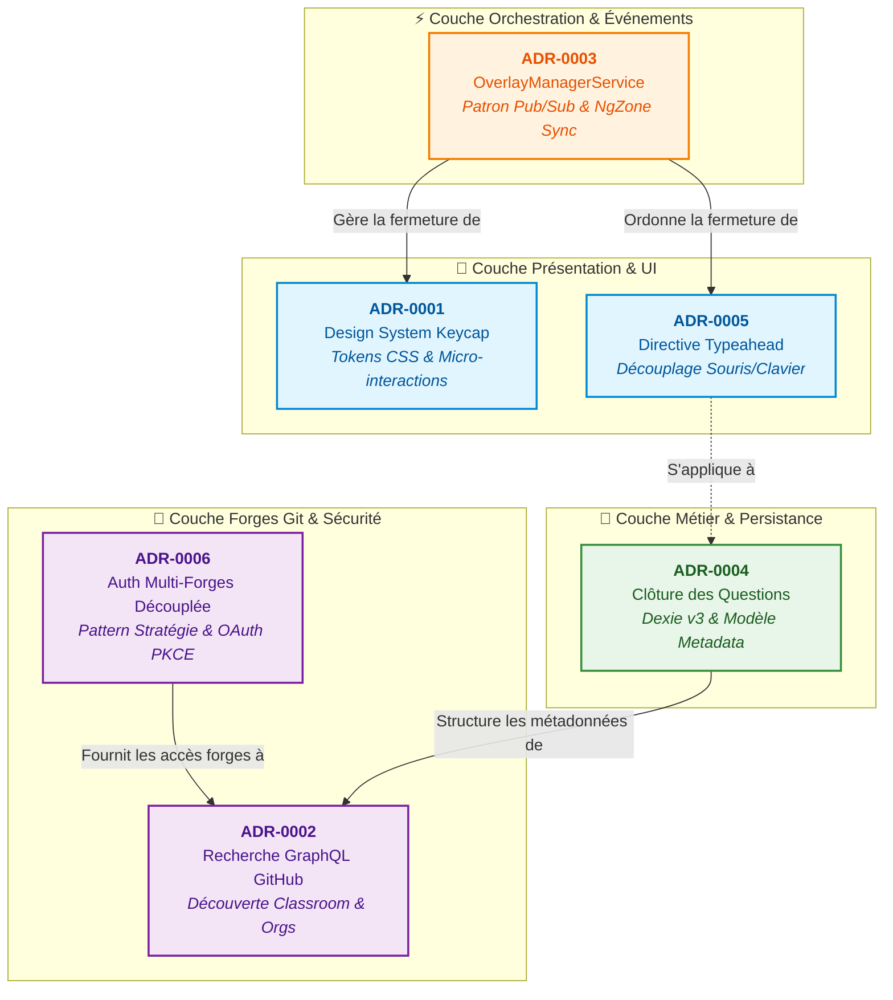
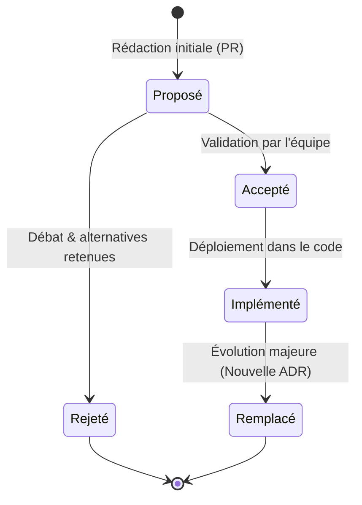

# 🏛️ Architecture Decision Records (ADR) — Git4School Visu

> Vitrine des choix structurants d'architecture, de conception logicielle, d'ergonomie et de sécurité guidant l'évolution pérenne de **Git4School Visu**.

[](https://github.com/git4school/git4school-visu/tree/master/docs/adr)
[](https://github.com/git4school/git4school-visu/tree/master/docs/adr)
[](https://github.com/git4school/git4school-visu)
[](https://github.com/git4school/git4school-visu)

---

## 📖 Pourquoi des ADRs dans Git4School Visu ?

Une **ADR (Architectural Decision Record)** est un document court et pragmatique qui capture une décision d'architecture significative, son contexte initial, les options examinées, les justifications techniques et l'ensemble de ses conséquences (positives comme négatives).

Dans un projet open-source et pédagogique comme **Git4School Visu**, les ADRs remplissent quatre rôles fondamentaux :
1. **Mémoire vivante & Rationale** : Comprendre instantanément *pourquoi* un composant ou un service a été conçu ainsi (par ex. pourquoi le protocole PKCE a été retenu pour GitLab ou pourquoi une directive gère le typeahead).
2. **Prévention des régressions d'architecture** : Éviter de réintroduire d'anciennes dettes techniques ou des anti-patterns déjà résolus (ex. hacks directs sur le DOM ou couplages omniscients).
3. **Alignement d'équipe & Intégration fluide** : Accélérer la montée en compétences des nouveaux contributeurs et partenaires académiques.
4. **Gouvernance technique partagée** : Offrir un cadre de conception strict, auditable et pérenne pour guider l'ensemble des développeurs et contributeurs du projet.

---

## 🗺️ Cartographie & Radar Architectural

Le schéma ci-dessous illustre l'imbrication des décisions d'architecture à travers les différentes couches de l'application :



---

## 📊 Tableau de bord des décisions (Index)

| Réf | Décision | Domaine | Patrons & Concepts Clés | Statut | Fichier Source |
| :---: | :--- | :--- | :--- | :---: | :---: |
| **0001** | [Standardisation du composant Keycap](#adr-0001--standardisation-du-composant-keycap-dans-le-design-system) | Design System / A11y | CSS Custom Properties, Balise sémantique `<kbd>`, Dark Mode | `Accepté` | [0001-keycap-design-system.md](https://github.com/git4school/git4school-visu/blob/master/docs/adr/0001-keycap-design-system.md) |
| **0002** | [Découverte des dépôts GitHub GraphQL](#adr-0002--stratégie-de-recherche-et-découverte-des-dépôts-github-graphql) | Intégration API / UX | GraphQL Aliases, GitHub Classroom, Normalisation de motif | `Accepté` | [0002-recherche-et-decouverte-des-depots.md](https://github.com/git4school/git4school-visu/blob/master/docs/adr/0002-recherche-et-decouverte-des-depots.md) |
| **0003** | [Gestion réactive des overlays et popovers](#adr-0003--gestion-réactive-et-découplée-des-overlays-et-popovers-pubsub) | Architecture Réactive | Publish-Subscribe, RxJS `Subject`, Synchronisation `NgZone`, D3.js | `Accepté` | [0003-gestion-reactive-des-overlays-et-popovers.md](https://github.com/git4school/git4school-visu/blob/master/docs/adr/0003-gestion-reactive-des-overlays-et-popovers.md) |
| **0004** | [Clôture des questions et migration Dexie](#adr-0004--stratégie-de-clôture-des-questions-import-en-masse-et-rétrocompatibilité-dexie) | Modèle Métier / Stockage | IndexedDB (Dexie v3), Analyse heuristique Git, Parsing délimité | `Accepté` | [0004-strategie-de-cloture-des-questions-et-retrocompatibilite-dexie.md](https://github.com/git4school/git4school-visu/blob/master/docs/adr/0004-strategie-de-cloture-des-questions-et-retrocompatibilite-dexie.md) |
| **0005** | [Navigation clavier typeahead sans conflit](#adr-0005--neutralisation-des-conflits-souris-clavier-dans-les-suggestions-typeahead-directive-déclarative) | Ergonomie UI / Événements | Directive déclarative Angular, OCP/SRP, `runOutsideAngular`, CSS isolates | `Accepté` | [0005-navigation-clavier-typeahead-directive-decouplee.md](https://github.com/git4school/git4school-visu/blob/master/docs/adr/0005-navigation-clavier-typeahead-directive-decouplee.md) |
| **0006** | [Authentification multi-forges et OAuth 2.0 PKCE](#adr-0006--authentification-multi-forges-découplée-pattern-stratégie--fournisseurs-et-oauth-20-pkce) | Sécurité / Architecture SOLID | Pattern Stratégie, Registre polymorphique, RFC 7636 (PKCE), Web Crypto API | `Accepté` | [0006-authentification-multi-fournisseurs-pattern-strategie.md](https://github.com/git4school/git4school-visu/blob/master/docs/adr/0006-authentification-multi-fournisseurs-pattern-strategie.md) |

---

## 🌟 Vitrine détaillée des décisions (Showcase)

### ADR-0001 : Standardisation du composant Keycap dans le Design System

> *Harmonisation visuelle, accessibilité sémantique et micro-interactions des touches de raccourcis.*

```
┌────────────────────────────────────────────────────────┐
│  Tags : #DesignSystem #HTML5Sémantique #CSSCustomTokens │
│  Impact : Global UI, ShortcutsModal, Tooltips, Chooser │
└────────────────────────────────────────────────────────┘
```

- **Le Défi** : Les touches de raccourcis clavier et indicateurs d'interaction étaient dispersés dans le code avec des implémentations hétérogènes (balises `<span>` vs `<kbd>`, classes locales `.shortcut-badge`, `.cheat-badge`, `.shortcut-key`, styles d'ombres intérieures vs ombres douces, couleurs hexadécimales en dur).
- **La Décision** :
  1. Centralisation dans `_components.scss` sous les sélecteurs unifiés `kbd, .shortcut-key, .shortcut-badge`.
  2. Standardisation sur la balise sémantique HTML5 native `<kbd class="shortcut-key">`.
  3. Support complet du Dark Mode sans aucune couleur en dur, via les tokens CSS globaux (`--color-bg-body`, `--color-border`, `--color-text-primary`, `--color-primary`).
  4. Création de variantes : taille standard (22px), compacte `.shortcut-key-sm` (18px) pour les zones denses, et conteneur `.shortcut-combo` avec séparateur `.key-sep`.
  5. Micro-interaction d'appui physique (`.shortcut-pressed-anim` avec `scale(0.92)`).
- **Bénéfice majeur** : Un composant d'interface universel, responsive, accessible et parfaitement fondu dans le thème clair comme sombre.
- 📄 Consulter l'ADR complet : [`docs/adr/0001-keycap-design-system.md`](https://github.com/git4school/git4school-visu/blob/master/docs/adr/0001-keycap-design-system.md)

---

### ADR-0002 : Stratégie de recherche et découverte des dépôts GitHub GraphQL

> *Résolution intelligente et arborescente des dépôts étudiants et organisations d'enseignement.*

```
┌──────────────────────────────────────────────────────────────┐
│  Tags : #GraphQL #GitHubClassroom #Algorithme #UXRecherche   │
│  Impact : ModalAddRepositoriesComponent, CommitsService      │
└──────────────────────────────────────────────────────────────┘
```

- **Le Défi** : L'API de recherche globale GitHub n'indexe par défaut que les dépôts publics, rendant les dépôts d'organisations d'enseignement privés (ex: `UE-TOAW`, `CLJ5059A`) introuvables. De plus, la recherche ouverte ramenait des dépôts tiers mondiaux non pertinents, et les dépôts de devoirs créés de manière autonome par GitHub Classroom (sans lien de parenté Git formel `fork`) étaient omis.
- **La Décision** :
  1. **Découverte automatique des organisations** : Récupération des organisations de l'utilisateur avec mise en cache `shareReplay(1)` pour éviter tout appel redondant.
  2. **Multi-requêtes GraphQL parallélisées par alias** : Découpage intelligent selon la saisie (URL directe, préfixe d'organisation, motif `owner/name` ou texte libre).
  3. **Normalisation de motif d'assignation (`extractAssignmentCore`)** : Extraction du cœur sémantique du devoir en éliminant les préfixes d'organisation et suffixes de templates pour identifier à coup sûr tous les dépôts étudiants associés.
  4. **Scission et pliage interactif des résultats** : Séparation claire entre « Correspondances par nom » et « Correspondances dans la description ou le README », avec accordéon interactif.
  5. **Arborescence visuelle des forks** : Dépôts étudiants indentés directement sous le modèle avec guides arborescents `└─`.
- **Bénéfice majeur** : Découverte instantanée et sans friction des promotions entières de TP sans exiger la saisie fastidieuse des dizaines d'URLs étudiantes.
- 📄 Consulter l'ADR complet : [`docs/adr/0002-recherche-et-decouverte-des-depots.md`](https://github.com/git4school/git4school-visu/blob/master/docs/adr/0002-recherche-et-decouverte-des-depots.md)

---

### ADR-0003 : Gestion réactive et découplée des overlays et popovers (Pub/Sub)

> *Éradication des hacks DOM et synchronisation fluide entre D3.js et le cycle de détection Angular.*

```
┌────────────────────────────────────────────────────────────┐
│  Tags : #RxJS #PubSub #NgZone #D3js #ArchitecturePropre    │
│  Impact : OverviewComponent, TooltipService, Typeahead     │
└────────────────────────────────────────────────────────────┘
```

- **Le Défi** : `OverviewComponent` agissait comme un contrôleur omniscient manipulant impérativement ses enfants via de multiples `@ViewChild`. Des hacks destructifs de DOM (`document.querySelector("ngb-typeahead-window")?.remove()`) étaient utilisés pour forcer la fermeture de popups tiers. L'exécution d'événements de souris dans D3 en dehors de la zone Angular générait des sauts graphiques brutaux de dropdowns sous la barre de navigation.
- **La Décision** :
  1. Création de `OverlayManagerService`, un bus d'événements singleton basé sur le patron **Publish-Subscribe** via un `Subject<OverlayDismissEvent>`.
  2. Typage granulaire des overlays (`TOOLTIP`, `CONTEXT_MENU`, `TYPEAHEAD`, `QUICK_HELP`, `DROPDOWN`, `ALL`).
  3. Sécurisation synchrone systématique dans `ngZone.run()` pour forcer un rafraîchissement d'état Angular immédiat sans étape transitoire brisée.
  4. Auto-gestion des composants récepteurs qui s'abonnent et se détruisent proprement via `takeUntil(destroy$)`.
  5. Règle d'architecture formalisée imposant l'usage exclusif de `OverlayManagerService` pour coordonner la fermeture des éléments flottants.
- **Bénéfice majeur** : Plus aucun appel à `querySelector` pour manipuler le DOM de composants tiers, fin définitive des scintillements et stabilité absolue des graphiques D3.
- 📄 Consulter l'ADR complet : [`docs/adr/0003-gestion-reactive-des-overlays-et-popovers.md`](https://github.com/git4school/git4school-visu/blob/master/docs/adr/0003-gestion-reactive-des-overlays-et-popovers.md)

---

### ADR-0004 : Stratégie de clôture des questions, import en masse et rétrocompatibilité Dexie

> *Flexibilité pédagogique sur la détection des commits, assistant ergonomique et migration IndexedDB sans perte.*

```
┌────────────────────────────────────────────────────────────┐
│  Tags : #IndexedDB #Dexie #ModèleMétier #Pédagogie        │
│  Impact : Metadata, CommitModel, QuestionsChooser, Popover │
└────────────────────────────────────────────────────────────┘
```

- **Le Défi** : La détection des questions résolues reposait sur une expression régulière codée en dur ciblant uniquement les verbes GitHub (`fix`, `close`). Les enseignants souhaitant valider les jalons via d'autres mots-clés (`rendu`, `validé`) ou directement par l'identifiant de la question (`[ITER 1]`) étaient bloqués. L'ajout des questions se faisait une à une et risquait de corrompre les devoirs déjà stockés dans IndexedDB.
- **La Décision** :
  1. Enrichissement du modèle `Metadata` avec 3 modes configurables : `standard` (GitHub), `custom` (mots-clés libres de l'enseignant), et `none` (détection directe par nom de question).
  2. Migration de schéma Dexie `version(3)` dans `DatabaseService` garantissant l'initialisation transparente de tous les devoirs existants en base locale sans perte.
  3. Conception du composant `QuestionsAssistantPopoverComponent` intégrant un générateur de séries (`1..N`, `A..Z`), un panneau d'import multi-délimiteurs (`\n`, `,`, `;`, `\t`), et la configuration de la règle de clôture.
  4. Détection intelligente au copier-coller (`paste`) dans le champ des questions avec scission automatique et dédoublonnage.
- **Bénéfice majeur** : Adaptabilité totale à toutes les démarches pédagogiques universitaires et gain de temps massif lors de la configuration des devoirs.
- 📄 Consulter l'ADR complet : [`docs/adr/0004-strategie-de-cloture-des-questions-et-retrocompatibilite-dexie.md`](https://github.com/git4school/git4school-visu/blob/master/docs/adr/0004-strategie-de-cloture-des-questions-et-retrocompatibilite-dexie.md)

---

### ADR-0005 : Neutralisation des conflits souris-clavier dans les suggestions Typeahead (Directive déclarative)

> *Élimination des sauts visuels lors de la navigation fléchée sans toucher au code des composants consommateurs.*

```
┌────────────────────────────────────────────────────────────┐
│  Tags : #DirectiveAngular #SOLID #OCP #PerformanceDOM      │
│  Impact : SharedUiModule, QuestionsChooser, TextInput      │
└────────────────────────────────────────────────────────────┘
```

- **Le Défi** : Lors de la navigation aux flèches dans les suggestions d'autocomplétion (`ngbTypeahead`), le fait de laisser le curseur de la souris immobile sur la liste déclenchait des événements synthétiques `mouseenter` émis par le navigateur lors des reflows DOM. Cela provoquait des allers-retours chaotiques de sélection et un double surbrillance visuelle `:hover` / `.active`.
- **La Décision** :
  1. Conception d'une directive déclarative `TypeaheadKeyboardNavDirective` ciblant `input[ngbTypeahead]`.
  2. Respect strict du principe Ouvert/Fermé (OCP) : s'applique immédiatement à tous les champs présents et futurs sans modifier leur logique métier.
  3. Gestion éphémère des écouteurs d'événements de rétablissement (`mousemove`, `mousedown`, `wheel`) : rattachés uniquement pendant la phase active de navigation clavier, exécutés hors zone Angular (`runOutsideAngular`) avec un seuil de mouvement de sécurité (> 2px) pour filtrer les micro-événements parasites.
  4. Neutralisation CSS instantanée (`pointer-events: none !important` et suppression des transitions pendant la navigation fléchée).
- **Bénéfice majeur** : Navigation clavier d'une netteté parfaite, zéro fuite mémoire, zéro écouteur passif persistant en arrière-plan.
- 📄 Consulter l'ADR complet : [`docs/adr/0005-navigation-clavier-typeahead-directive-decouplee.md`](https://github.com/git4school/git4school-visu/blob/master/docs/adr/0005-navigation-clavier-typeahead-directive-decouplee.md)

---

### ADR-0006 : Authentification multi-forges découplée (Pattern Stratégie & Fournisseurs) et OAuth 2.0 PKCE

> *Ouverture multi-fournisseurs (GitHub + GitLab Cloud), sécurité client-side conforme RFC 7636 et zéro secret applicatif exposé.*

```
┌────────────────────────────────────────────────────────────┐
│  Tags : #OAuth2PKCE #PatternStratégie #RFC7636 #Sécurité   │
│  Impact : AccountsService, GithubAuth, GitlabAuth, Guards  │
└────────────────────────────────────────────────────────────┘
```

- **Le Défi** : L'authentification était historiquement liée de manière monolithique à GitHub via Firebase Auth. L'ouverture à GitLab (plateforme cloud puis instances auto-hébergées) imposait de respecter l'architecture Single Page Application (SPA statique distribuée sur Firebase Hosting) : aucun secret client (*Client Secret*) ne pouvait être inclus dans le code client sans compromettre la sécurité. De plus, les API Gateways de GitLab présentaient parfois de légères latences de propagation du token provoquant des erreurs 401 temporaires.
- **La Décision** :
  1. **Contrat d'interface formel `GitAuthProvider`** : Abstraction normalisée unifiant le cycle de vie (`signIn`, `signOut`, `isSignedIn`, `getToken`, `getUserProfile`, `isAvailable`).
  2. **Pattern Stratégie & Registre centralisé (`AccountsService`)** : Source unique de vérité stockant les fournisseurs dans une table de correspondance typée `Map<GitProviderType, GitAuthProvider>`.
  3. **Implémentation OAuth 2.0 avec PKCE (RFC 7636)** : Flux d'autorisation complet exécuté dans le navigateur sans dépendance externe lourde, utilisant la Web Crypto API (`window.crypto.getRandomValues`, hachage SHA-256 et Base64-URL pour le `code_challenge`, validation du `state` anti-CSRF).
  4. **Résilience et atomicité** : Affectation atomique de la session et mécanisme de nouvelle tentative automatique avec délai d'attente pour absorber les latences de réplication réseau.
  5. **Découplage de `AuthGuard` et polymorphisme d'UI** : `AuthGuard` s'appuie désormais sur `!accountsService.isEmpty()` et la modale d'ajout de compte factorise l'affichage via des templates réutilisables.
- **Bénéfice majeur** : Architecture SOLID hautement extensible permettant d'ajouter facilement toute nouvelle forge (GitLab Community auto-hébergé, Bitbucket, forges universitaires) avec un niveau de sécurité client optimal.
- 📄 Consulter l'ADR complet : [`docs/adr/0006-authentification-multi-fournisseurs-pattern-strategie.md`](https://github.com/git4school/git4school-visu/blob/master/docs/adr/0006-authentification-multi-fournisseurs-pattern-strategie.md)

---

## 🧭 Principes directeurs de l'architecture Git4School Visu

L'ensemble de ces ADRs applique un socle commun d'exigences et de bonnes pratiques techniques partagées au sein du projet :

```
┌─────────────────────────────────────────────────────────────────────────────┐
│                       Principes Directeurs Communs                          │
├─────────────────────────────────────────────────────────────────────────────┤
│ 1. SOLID & Clean Code       : Interfaces fortes, découplage, responsabilités│
│                               uniques, zéro code dupliqué.                  │
│ 2. Isolation D3 / Angular   : Respect de NgZone, pas de désynchronisation   │
│                               ni de hacks directs sur le DOM tiers.         │
│ 3. Theming & Tokens CSS     : Compatibilité Dark Mode native sans couleur   │
│                               hexadécimale en dur dans les composants.      │
│ 4. Sécurité Client-Side     : Flux OAuth 2.0 PKCE sans secret client exposé │
│                               dans les bundles frontend.                    │
│ 5. Rétrocompatibilité       : Évolution défensive des schémas IndexedDB     │
│                               avec migration automatisée.                   │
└─────────────────────────────────────────────────────────────────────────────┘
```

---

## ✍️ Comment proposer une nouvelle ADR ?

### Cycle de vie d'une décision



1. **Numérotation séquentielle** : Créer un fichier Markdown dans `docs/adr/` sous la forme `XXXX-titre-court-en-kebab-case.md` (ex: `0007-nouvelle-decision.md`).
2. **Utiliser le template standard** : Renseigner scrupuleusement le contexte, les options étudiées, la décision finale et ses conséquences.
3. **Mettre à jour cette vitrine** : Ajouter la nouvelle entrée dans le tableau de bord et dans la section Showcase.
4. **Mettre à jour la documentation d'architecture** : Référencer la nouvelle règle dans cette vitrine et documenter les impacts techniques.

<details>
<summary><b>📋 Modèle Markdown d'ADR à copier (Template)</b></summary>

```markdown
# XXXX - [Titre de la décision architecturale]

## Contexte
[Décrire la situation initiale, les besoins fonctionnels ou techniques, les limites rencontrées et la dette technique à résoudre.]

## Options considérées
1. **Option A : [Titre]**
   - *Avantages / Inconvénients* : [...]
   - *Verdict* : [Rejeté - Justification]
2. **Option B : [Titre]** (Option retenue)
   - *Avantages / Inconvénients* : [...]

## Décision
1. **[Composant / Service clé]** : [Détail de l'architecture retenue]
2. **[Patron de conception]** : [Explication du découplage et des contrats]
3. **[Règles d'implémentation]** : [Normes de sécurité, d'ergonomie ou de style]

## Conséquences
- **Positives** : [Gains en maintenabilité, performance, extensibilité, sécurité...]
- **Contraintes / Négatives** : [Points d'attention, complexité induite éventuelle...]
- **Mises à jour documentaires** : [Mise à jour de la vitrine d'architecture et des guides associés]
```

</details>

---

*Page maintenue par l'équipe Git4School. Pour toute question ou proposition, ouvrez une issue ou soumettez une Pull Request.*
